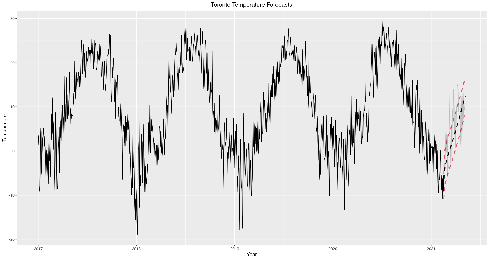

# Toronto Temperature Time Series Analysis
#### Forecasting temperatures in downtown Toronto under Box-Jenkins. 

#### Check out the Analysis: [[Notebook]](https://nbviewer.jupyter.org/github/SebastianLech/toronto_temps/blob/main/analysis_notebook.ipynb)

#### Covers:

- Gathering Data
- Exploratory Analysis
- Model Fitting
- Forecasting

#### Data

https://climate.weather.gc.ca/historical_data/search_historic_data_e.html

